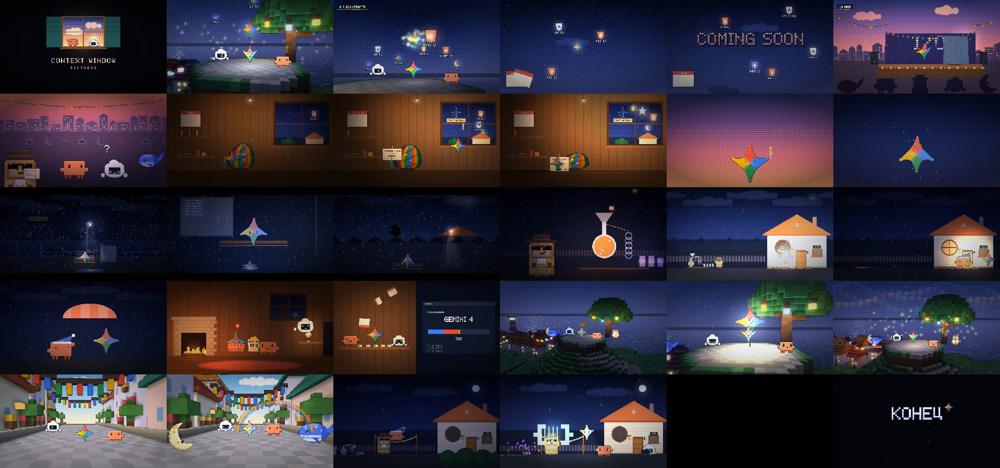
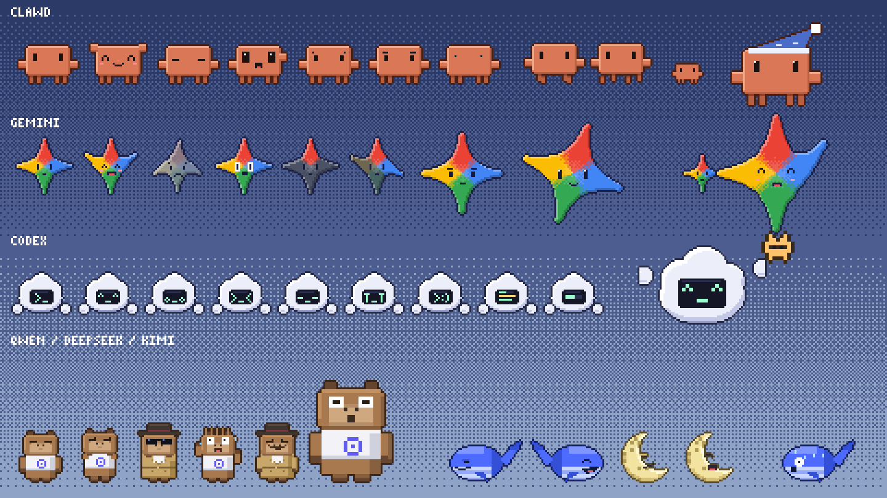

# COMING SOON — пиксельный мультфильм, сделанный кодом

Трёхминутный мультфильм 16:9 (1920×1080, 30 fps) про Clawd, Codex и Gemini (и немного — Qwen).
Всё сделано кодом: персонажи, фоны, воксельные 3D-сцены, свет, переходы, музыка и звуки.
Никаких готовых картинок, спрайтов, звуков или библиотек — только JavaScript и ffmpeg для кодирования.

Сюжет и раскадровка — в [STORY.md](STORY.md).





## Как собрать видео

Нужны Node.js 20+ и ffmpeg (libx264, aac).

```bash
cd multfilm
node tools/audio.mjs                    # саундтрек -> out/soundtrack.wav (~10 с)
node tools/render.mjs --workers 3       # кадры + звук -> out/coming-soon.mp4
```

Полезное при работе над сценами:

```bash
node tools/still.mjs 132.5 out/still.png 2        # один кадр (секунда фильма, масштаб)
node tools/sheet.mjs 128 144 9 3 out/sheet.png    # контактный лист: 9 кадров из диапазона
node tools/chars.mjs out/chars.png 3              # лист персонажей и эмоций
node tools/render.mjs --from 128 --to 144         # рендер только куска
```

## Как это устроено

- `src/engine/` — собственный движок:
  - `fb.js` — пиксельный буфер 480×270 с альфой, примитивы, спрайты, обводка;
  - `font.js` — рисованные битмап-шрифты 5×7 (латиница + кириллица) и 3×5;
  - `fx.js` — карта освещения (фонари, конусы света), частицы, дождь, светлячки, переходы;
  - `vox.js` — программный воксельный 3D-рендер: z-буфер, запечённый AO, точечный свет,
    туман, пиксельные контуры, bloom и 2D-персонажи внутри 3D (стиль HD-2D);
  - `sky.js` — небесный купол со звёздами и море, отрисованное рейкастом.
- `src/chars/` — персонажи, нарисованные процедурно, с позами и эмоциями:
  Clawd (силуэт терминального маскота Claude Code), Codex (облачко с терминалом вместо лица
  и мигающим курсором `>_`), Gemini (четырёхлучевая звёздочка в цветах Google, лучи работают как руки),
  Qwen (капибара-маскот в белой футболке с логотипом), кит DeepSeek, луна Kimi.
- `src/world/` — воксельные миры (холм с деревом, городок, маяк; утренняя улица) и домик Clawd.
- `src/scenes/` — 14 сцен; каждая рисует кадр как чистую функцию от времени,
  поэтому любой кадр можно отрендерить отдельно, а кадры считаются параллельно.
- `src/audio/` — офлайн-синтезатор (чиптюн, FM-колокольчики, «пианино», щипковые струны Карплуса–Стронга,
  барабаны, реверберация) и партитура, привязанная к таймлайну сцен.
- `tools/` — рендер в MP4 (кадры → ffmpeg, увеличение ×4 без сглаживания), кадры, контактные листы.
